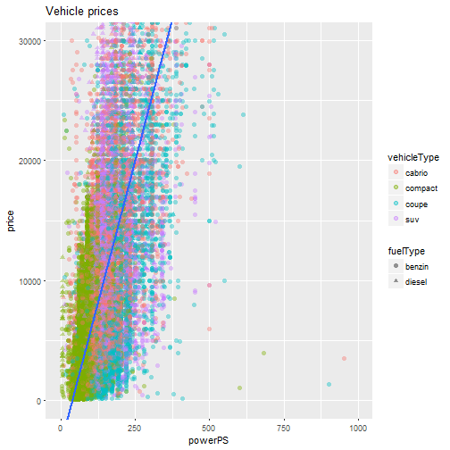

second hand caR
========================================================
author: ZeroProfanity
date: 19 april 2017
autosize: true
transition: rotate
incremental: false
font-import: https://fonts.googleapis.com/css?family=Lato
font-family: 'Lato', sans-serif;


second hand caR
========================================================
incremental: true
## Ever wanted to sell your car, but you didn't know what would be a reasonble price?  

## Ever got ripped off trying to buy a second hand car?

## Now, you can do your research beforehand, using our webapp:

# second hand caR

Specify the details of the car...
========================================================
## Tell us the desired
- Age range  
- Horsepower range  
- Kilometer driven range  
- Fuel type  
- Transmission type  
- Car body type   

And second hand caR will give you the data at your fingertips
========================================================


```
[1] "Mean price is 7606.43923185418"
```


For more information
========================================================
[The webapp](https://gloriousninth.shinyapps.io/second_hand_car/)  
[The original dataset](https://www.kaggle.com/orgesleka/used-cars-database/)  
[Github site containing the scripts]()  
